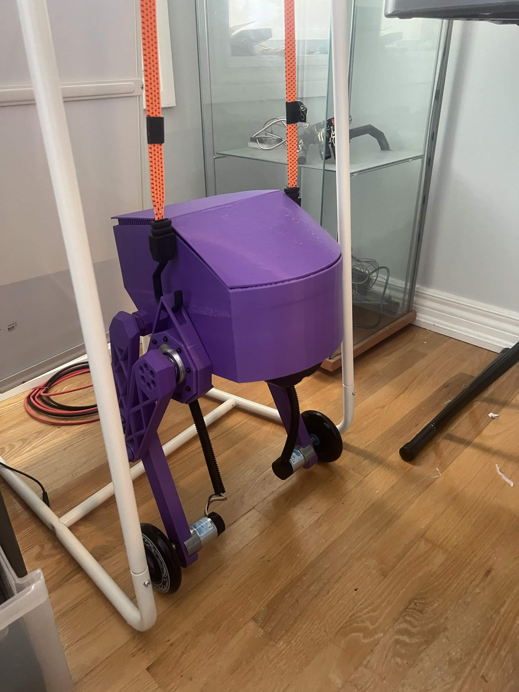
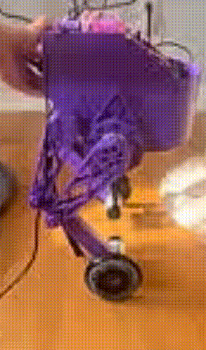
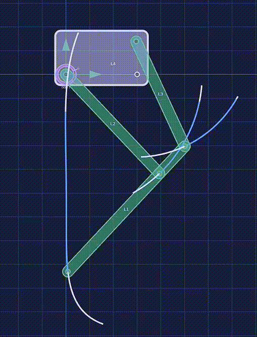
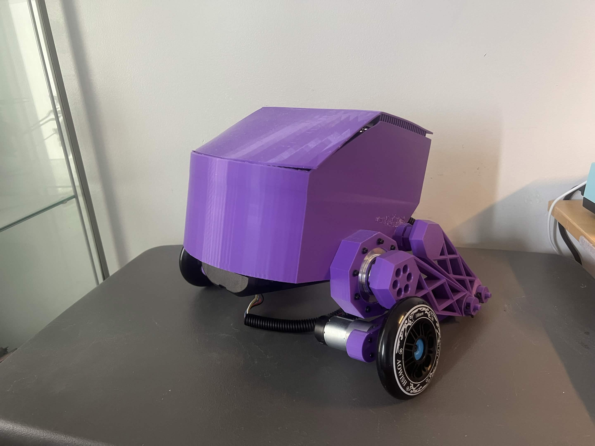

# Wheeled Bipedal Robot

A custom wheeled-bipedal robot that uses articulated legs and a pair of driven wheels to raise its body and actively balance.

<figure>
    <figcaption>Figure 1: Robot in its standing pose</figcaption>
    
</figure>

<figure>
    <figcaption>Figure 2: Early balance test</figcaption>
    
</figure>

The project combines a parallel-linkage leg mechanism with a wheeled inverted-pendulum controller. The leg actuators set and hold the body height, while the wheel motors respond to pitch and wheel-speed feedback to keep the robot upright. The current firmware focuses on pose control, balance tuning, safety limits, and high-rate telemetry.

## Hardware

### Mechanical

The body, enclosure, wheel adapters, mounting plates, and leg linkages were custom-designed in Autodesk Inventor and manufactured primarily with 3D-printed parts. The leg geometry was first studied as a planar linkage before being transferred into the full CAD assembly.

<figure>
    <figcaption>Figure 3: Parallel-linkage motion study</figcaption>
    
</figure>

<figure>
    <figcaption>Figure 4: Robot in its lowered pose</figcaption>
    
</figure>

The native Autodesk Inventor part files are available in the [`parts`](parts/) folder.

### Electrical

- 1 x ESP32 development board
- 2 x RobStride 01 CAN smart actuators for the leg joints
- 2 x 37D 12 V, 50:1 geared DC motors with quadrature encoders
- 2 x BTS7960 H-bridge motor drivers
- 1 x MPU6050 six-axis IMU
- 2 x 100 mm wheels

## Software

1. **Pose control:** The ESP32 commands the two CAN joint actuators in position mode to raise the robot into its standing pose or lower it into its resting pose.

2. **Sensing:** The IMU provides acceleration and angular-rate measurements, while the wheel encoders provide wheel position and velocity feedback.

3. **State estimation:** A gyro-led complementary filter estimates body pitch. Accelerometer correction is gated during fast motion, and an online bias estimator compensates for slow gyro drift.

4. **Balance control:** A 200 Hz controller combines pitch error, pitch rate, integral correction, and wheel-velocity damping to calculate the wheel effort needed to stay upright.

5. **Motor output:** The wheel commands are converted to 20 kHz PWM signals for the two BTS7960 drivers. Both wheel motors receive the balance effort simultaneously.

6. **Safety:** A tip-over limit disables balancing and stops the wheels when the measured pitch moves outside the recoverable range. Serial kill commands provide an immediate manual stop.

7. **Tuning and telemetry:** Controller gains, pose targets, dead-zone compensation, and filter settings can be adjusted over serial without reflashing. The firmware can capture full-rate response traces for later analysis.

The [`tools/lqr_gains.py`](tools/lqr_gains.py) script estimates starting gain ratios from a wheeled inverted-pendulum model. The [`tools/capture_serial.py`](tools/capture_serial.py) utility provides an interactive serial terminal and saves telemetry bursts as CSV files.

## Repository Contents

- [`wheeled-bipedal.ino`](wheeled-bipedal.ino): main ESP32 firmware
- [`TWAI_CAN_MI_Motor.cpp`](TWAI_CAN_MI_Motor.cpp) and [`TWAI_CAN_MI_Motor.h`](TWAI_CAN_MI_Motor.h): CAN motor interface for the leg actuators
- [`tools`](tools/): balance-analysis and telemetry utilities
- [`parts`](parts/): Autodesk Inventor CAD part files
- [`images`](images/): project photos, demonstrations, and motion study
